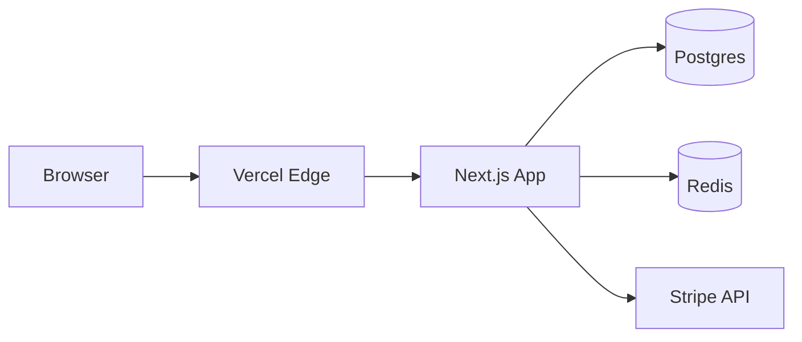

# Phase 2: Architecture Mapping

**Goal:** Build a structural understanding of how the system actually works at runtime, and surface every uncertainty as an explicit Open Question for the user to answer.

**Output:** `docs/_working/architecture-notes.md`

**Stop condition:** Present the architecture notes and Open Questions to the user. Wait for answers to all blocking questions before proceeding to Phase 3.

**Prerequisite:** Phase 1 inventory must be complete and user-confirmed.

## Workflow

Use the inventory from Phase 1 as your starting point. Cross-reference it with actual code reads. The goal here is not exhaustive — the goal is to capture the mental model a senior engineer would have after a one-week deep-dive.

Read code purposefully. Start at entry points and follow the most important request/data paths. Don't try to read everything.

## Architecture Notes Structure

````markdown
# Architecture Notes

Generated: <date>

## System Overview

A 3-5 sentence description of what the system does in mechanical terms (not marketing). Example:

> The system is a Next.js app deployed to Vercel with a Postgres database
> via Prisma. It serves a B2B dashboard with email/password auth (NextAuth),
> background job processing via Inngest, and webhook integrations with
> Stripe and Slack.

## Runtime Topology

A description of the processes that run in production:

- Web server(s)
- Workers
- Cron / scheduled jobs
- External services depended on
- Where each component runs (Vercel edge, Vercel node, Fly machine, etc.)

If helpful, include a Mermaid diagram. Keep it small — 5-10 nodes max.


````

## Request Lifecycle

Walk through what happens when a typical request hits the system. Be specific to the codebase, not generic.

Example for a Next.js app:

1. Request hits `middleware.ts` — auth check, locale routing
2. Routed to `app/(app)/dashboard/page.tsx` — server component
3. Server component calls `lib/queries/getDashboardData.ts` — Prisma queries
4. Result rendered, HTML streamed back

## Data Model

Summarize the core entities and their relationships. Reference the schema file directly. Don't reproduce the entire schema — just the key entities and how they relate.

| Entity | Purpose | Key Relations                      |
| ------ | ------- | ---------------------------------- |
| User   | Account | hasMany Sessions, hasMany Projects |
| ...    | ...     | ...                                |

Note any non-obvious patterns (soft deletes, multi-tenancy via row-level security, event sourcing, etc.).

## Authentication and Authorization

- Where auth is initiated
- Session storage mechanism
- How protected routes are guarded
- Role/permission model (if any)
- Where authorization checks live (middleware, route handlers, service layer, database)

## External Integrations

For each external service from the inventory, document:

- What it's used for
- Where the integration code lives
- How credentials are configured
- Failure mode (does the app degrade or crash if the service is down?)

## Background Work

- Queue/job system (if any)
- How jobs are enqueued
- How workers process them
- Retry/failure handling

## Client/Server Boundary

For full-stack apps: what runs on the client vs. the server. For Next.js specifically:

- Server components vs. client components — predominant pattern
- Server actions used? Where?
- API routes — what's exposed
- Edge runtime usage

## Boundaries and Modules

How the codebase is internally organized. The mental model that lets a new developer know "this kind of code goes in this kind of place."

Example:

- `app/` — Next.js routes only, thin
- `lib/services/` — business logic, framework-agnostic
- `lib/db/` — Prisma client and query helpers
- `lib/integrations/` — external service clients

## Hidden Coupling and Footguns

Things a new contributor would trip over:

- Global state
- Side-effectful imports
- Magic environment variables
- Generated code that needs regeneration after schema changes
- Order-dependent migrations
- Singleton patterns

## Build and Bundle

- What happens during `build`
- What's emitted
- What's tree-shaken vs. bundled
- Static vs. server-rendered routes

## Deployment Model

- Where it's deployed
- How a deploy is triggered (push to main, manual, etc.)
- Environment promotion (preview → staging → prod)
- Rollback mechanism

## Observability

- Where logs go
- Metrics surface
- Error tracking
- Health checks

## Open Questions

List every question that the agent could not answer from the code alone, grouped by severity. The user must answer the **Blocking** questions before Phase 3 can proceed.

### Blocking (must answer before Phase 3)

1. Q: I see two auth providers configured (NextAuth and Clerk). Which one is actually in use?
2. Q: The `legacy/` directory is referenced in tsconfig but appears unused. Should it be documented or excluded?
3. ...

### Non-blocking (helpful but optional)

1. Q: What's the intended audience for the `/admin` routes?
2. ...

````

## Useful Commands

```bash
# Find every server entry point
rg -l 'export (default )?async function (GET|POST|PUT|DELETE|PATCH)' app/

# Find middleware
find . -name 'middleware.ts' -not -path '*/node_modules/*'

# Find Prisma schema
find . -name 'schema.prisma' -not -path '*/node_modules/*'

# Find all API routes (Next.js app router)
find app -name 'route.ts' -o -name 'route.tsx'

# Trace imports of a key module
rg "from ['\"].*lib/auth['\"]" -t ts

# Find all server actions
rg "^['\"]use server['\"]" -t ts
````

## Completion Criteria

Phase 2 is complete when:

- [ ] System overview is written in mechanical (not marketing) terms
- [ ] Request lifecycle is documented for the most common request type
- [ ] Data model entities and relationships are catalogued
- [ ] Auth/authz model is documented
- [ ] Every external integration from Phase 1 has been investigated
- [ ] Open Questions section contains every uncertainty (do not silently guess)
- [ ] Blocking questions are clearly marked

## Stop and Present

Present to the user in this form:

> Phase 2 (Architecture) is complete. The full notes are at `docs/_working/architecture-notes.md`.
>
> **System summary:** [one paragraph]
>
> **I have N blocking questions that I need you to answer before Phase 3:**
>
> 1. [Question 1]
> 2. [Question 2]
>    ...
>
> **And M non-blocking questions if you have time:**
>
> 1. ...
>
> Please answer the blocking questions and I'll incorporate the answers into the architecture notes before proceeding to Phase 3 (Synthesis).

**Do not proceed to Phase 3 until all blocking questions are answered. Update the architecture notes file with the answers before moving on.**
