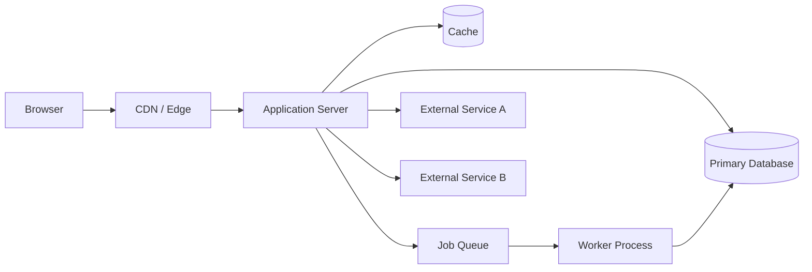

# Architecture

This document describes the runtime architecture, data model, and major subsystems of the project. It is intended for engineers contributing to or operating the system.

For the higher-level project overview, see [README.md](../README.md).
For local development setup, see [DEVELOPMENT.md](DEVELOPMENT.md).

## System Overview

Three to five sentences describing the system in mechanical terms. Example structure:

> The system is a [framework] application deployed to [hosting] backed by
> [database]. It serves [primary use case] for [audience]. Key subsystems
> include [auth], [data layer], and [integrations]. Background work runs
> via [job system].

## Runtime Topology

A description of the processes that run in production and how they communicate.

| Component | Runtime | Hosted On | Purpose |
|---|---|---|---|
| Web app | Node 20 | Vercel | Serves HTTP requests |
| Worker | Node 20 | Fly.io | Processes background jobs |
| Database | Postgres 16 | Supabase | Primary data store |
| Cache | Redis 7 | Upstash | Session and rate-limit storage |

## Request Lifecycle

A walkthrough of what happens when a typical request hits the system. Be specific to this codebase.

1. Request arrives at the edge
2. `middleware.ts` runs: locale detection, auth check, redirect logic
3. Request routed to the appropriate handler in `app/`
4. Handler invokes service layer in `lib/services/`
5. Service layer calls data layer in `lib/db/`
6. Response composed and returned

## Data Model

The full schema lives in [`prisma/schema.prisma`](../prisma/schema.prisma) (or equivalent). Below is a summary of the core entities and their relationships.

| Entity | Purpose | Key Relations |
|---|---|---|
| `User` | Account holder | hasMany `Session`, hasMany `Project` |
| `Project` | Top-level workspace | belongsTo `User`, hasMany `Item` |
| `Item` | Domain entity | belongsTo `Project` |

Notable patterns:
- Soft deletes via `deletedAt` column on entities X, Y
- Multi-tenancy via `organizationId` on every tenant-scoped table
- Audit trail in `audit_log` table populated by database triggers

## Authentication and Authorization

### Authentication

- Library: <name>
- Session storage: <mechanism>
- Supported providers: <list>
- Configuration: [`<path>`](<path>)

Login flow:
1. User submits credentials to `/api/auth/...`
2. Server validates against database
3. Session cookie set, redirected to dashboard

### Authorization

- Model: <RBAC | ABAC | custom>
- Where checks happen: <middleware | route | service | db>
- Role definitions: <location>

## External Integrations

| Service | Purpose | Code Location | Failure Mode |
|---|---|---|---|
| Stripe | Billing | `lib/integrations/stripe.ts` | Hard fail — billing endpoints return 503 |
| SendGrid | Email | `lib/integrations/email.ts` | Soft fail — emails queued for retry |
| OpenAI | LLM features | `lib/integrations/openai.ts` | Soft fail — feature degraded |

For each integration, credentials are configured via environment variables documented in [DEVELOPMENT.md](DEVELOPMENT.md#environment-variables).

## Background Work

- Job system: <name>
- How jobs are enqueued: <mechanism>
- Worker location: <path>
- Retry policy: <description>
- Dead letter handling: <description>

Job definitions live in [`<path>`](<path>).

## Client/Server Boundary

For full-stack frameworks (Next.js, Remix, etc.):

- Predominant pattern: <server components | client components | mixed>
- Server actions: <used | not used> — location
- API routes: <list of major endpoints>
- Edge runtime: <which routes>

## Module Boundaries

The codebase is organized around the following module boundaries. New code should fit into one of these layers.

| Directory | Purpose | Allowed Imports |
|---|---|---|
| `app/` | Routes and pages, thin | `lib/*`, `components/*` |
| `components/` | Presentational components | `lib/utils`, no business logic |
| `lib/services/` | Business logic | `lib/db`, `lib/integrations` |
| `lib/db/` | Database access | `lib/db` only |
| `lib/integrations/` | External service clients | Service SDKs |

## Build and Bundle

- Build command: `<command>`
- Output location: `<path>`
- Static assets: served from `<location>`
- Server bundle vs. client bundle: <description>

## Hidden Coupling and Footguns

Things a new contributor will trip over. Document these explicitly.

- **Schema regeneration:** After editing `schema.prisma`, you must run `pnpm db:generate` or types will be stale
- **Environment variable parsing:** All env vars are parsed at module load time in `lib/env.ts`. Adding a new required var requires updating this file.
- **Migration order:** Migrations are not idempotent. Do not edit existing migration files; create a new migration instead.
- **Middleware bypass:** Routes under `/api/public/*` bypass auth middleware. Do not put authenticated endpoints there.

## Observability

- Logging: <library and destination>
- Error tracking: <service>
- Metrics: <service>
- Traces: <service>
- Health check: `<endpoint>`

## Deployment

For full deployment details, see [DEPLOYMENT.md](DEPLOYMENT.md).

Summary:
- Hosting: <provider>
- Trigger: <push to main | manual | tag>
- Environments: <list>
- Rollback: <mechanism>
