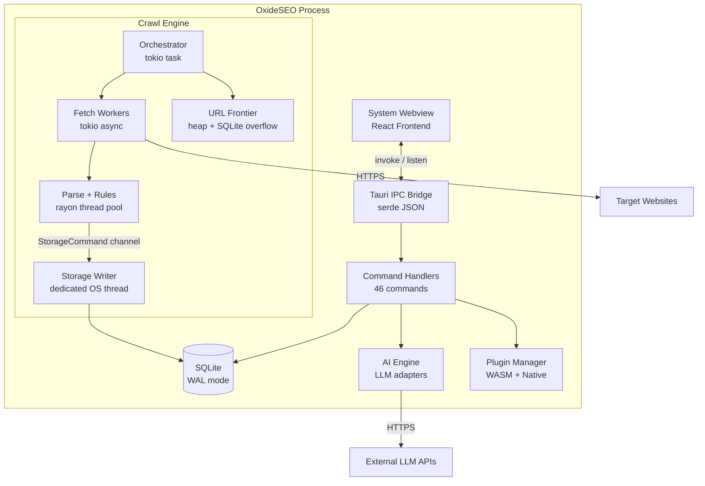

# Architecture

This document describes the runtime architecture, data model, and major subsystems of OxideSEO. It is intended for engineers contributing to or operating the system.

For the project overview, see [README.md](../README.md).
For local development setup, see [DEVELOPMENT.md](DEVELOPMENT.md).

## System Overview

OxideSEO is a cross-platform desktop application that crawls websites and evaluates them against SEO rules. It runs as a single Tauri v2 process hosting a system webview (React frontend) and a Rust backend. The backend contains a channel-based crawl engine that orchestrates HTTP fetching on tokio, HTML parsing and rule evaluation on rayon, and batched SQLite writes on a dedicated OS thread. The frontend communicates with the backend exclusively through Tauri IPC commands and event subscriptions. Optional AI analysis delegates to external LLM providers via user-provided API keys stored in the OS-native credential store. A plugin system supports WASM (sandboxed) and native (trusted) extensions.

## Runtime Topology

OxideSEO runs as a single OS process with multiple internal threads and runtimes:



| Component             | Runtime     | Concurrency              | Purpose                          |
| --------------------- | ----------- | ------------------------ | -------------------------------- |
| Main thread           | Tauri       | 1                        | Webview host, IPC dispatch       |
| Crawl orchestrator    | tokio task  | 1 per crawl              | URL scheduling, state machine    |
| Fetch workers         | tokio async | Configurable (default 8) | HTTP requests, redirect tracking |
| Parse + Rules         | rayon pool  | CPU count - 2            | HTML parsing, rule evaluation    |
| Storage writer        | OS thread   | 1 (serialized writes)    | Batched SQLite transactions      |
| External link checker | tokio task  | 1                        | HEAD requests for outbound links |
| AI engine             | tokio       | Sequential per batch     | LLM API calls with rate limiting |

No background daemons, cron jobs, or mandatory external service dependencies exist. AI providers are opt-in.

## Request Lifecycle: Crawl

The crawl is the core operation. This section traces the complete data flow from user action to completion.

### 1. Initiation

The user configures a crawl in the CrawlConfig form and clicks Start. The frontend calls `startCrawl(config)` via Tauri IPC.

In Rust (`commands/crawl.rs`):

1. Validate the `CrawlConfig` (URL format, regex pattern compilation)
2. Insert a new crawl record into SQLite with status `"running"`
3. Call `spawn_crawl()` to set up the engine and return a `CrawlHandle`
4. Store the handle in the global `CrawlHandles` map (keyed by crawl ID)
5. Return the crawl ID to the frontend

### 2. Engine Setup

`spawn_crawl()` in `crawler/engine.rs` creates all supporting infrastructure:

| Component             | Type                        | Purpose                                                                      |
| --------------------- | --------------------------- | ---------------------------------------------------------------------------- |
| Fetcher               | `Arc<Fetcher>`              | HTTP client (reqwest, manual redirect tracking, rustls-tls)                  |
| URL Frontier          | `Arc<Mutex<UrlFrontier>>`   | Priority queue: in-memory max-heap (10K cap) + SQLite overflow, blake3 dedup |
| Politeness Controller | `Arc<PolitenessController>` | Per-domain crawl delay (default 500ms) + per-host concurrency (default 2)    |
| Robots Cache          | `Arc<Mutex<RobotsCache>>`   | robots.txt fetch, cache (3600s TTL), Crawl-Delay extraction                  |
| Rule Registry         | `Arc<RuleRegistry>`         | Built-in + plugin rules with user config overrides                           |
| Compiled Patterns     | `Arc<CompiledPatterns>`     | URL include/exclude regex, rewrite rules                                     |
| JS Renderer           | Optional `Arc<JsRenderer>`  | Headless webview for SPA rendering                                           |
| Storage channel       | `mpsc::channel(5000)`       | Bounded channel to the storage writer thread                                 |
| State channel         | `watch::Sender<CrawlState>` | Broadcast for pause/resume/stop signals                                      |

The seed URL is enqueued into the frontier at depth 0, priority 100.

**Pre-crawl sitemap discovery** (if enabled): fetches robots.txt, discovers sitemap URLs from directives and well-known paths, fetches and parses all sitemaps in parallel, and enqueues discovered URLs at priority 150.

### 3. Orchestrator Loop

The main loop runs as a tokio task:

1. **Check state:** If `Stopped` -> break. If `Paused` -> block until `Running` or `Stopped`.
2. **Pop URL from frontier:** If empty and no in-flight requests -> crawl complete.
3. **robots.txt check:** Fetch and cache per domain, skip if disallowed.
4. **Politeness wait:** Honor per-domain crawl delay.
5. **Acquire permits:** Global semaphore (default 50 max concurrent) + per-host semaphore (default 2).
6. **Spawn async worker task** for the URL.

### 4. Worker Task (per URL)

**Fetch** (tokio async):

- HTTP request with manual redirect following (up to 10 hops, each recorded)
- blake3 hash of response body (capped at 10MB)
- On error: write errored page row, increment counter, return

**Parse** (rayon thread pool):

- `parse_html()` via lol_html (streaming) with scraper (DOM) fallback
- Extracts: title, meta description, canonical, viewport, H1-H6, links, images, scripts, stylesheets, word count, body text

**Rule evaluation** (rayon, same dispatch):

- `rule_registry.evaluate_page()` runs all enabled rules
- Returns `Vec<Issue>` with severity, category, message, detail

**JS rendering** (optional):

- Heuristic: few links + many scripts = likely SPA
- If triggered: render via hidden webview, re-parse, re-evaluate rules

**Link enqueuing:**

- For each internal, non-nofollow link within max depth: normalize URL, apply rewrite rules, compute blake3 hash, push to frontier with dedup check

**Storage:**

- Build `PageRow`, `Vec<LinkRow>`, `Vec<IssueRow>`
- Send as `StorageCommand::StorePage` through the bounded channel

### 5. Storage Writer Thread

Runs on a dedicated OS thread (not tokio):

1. Block on `mpsc::Receiver::blocking_recv()`
2. Drain available messages via `try_recv()` up to batch size (200)
3. Flush batch in a single SQLite transaction
4. Special commands: `Flush` (immediate), `FlushAck` (flush + oneshot ack), `Shutdown` (flush + exit)

The `StorePage` command is atomic: page upsert, link inserts, and issue inserts all commit in one transaction. The writer resolves auto-generated page IDs and sets them on related rows.

### 6. Progress Emission

The orchestrator emits `crawl://progress` events at most every 250ms or 50 URLs:

```
CrawlProgress {
    crawlId, urlsCrawled, urlsQueued, urlsErrored,
    currentRps, elapsedMs, recentUrls, memoryRssBytes
}
```

The frontend subscribes via the `useCrawlProgress` hook and updates the Zustand `crawlStore`.

### 7. Completion

When the frontier is empty and no requests are in-flight:

1. Close external checker channel, wait for drain
2. Flush storage writer via `FlushAck` (blocks until all pending writes are committed)
3. Run `PostCrawlAnalyzer` on a blocking thread:
   - Duplicate titles, descriptions, H1s (cross-page GROUP BY queries)
   - Broken internal links (links targeting 4xx/5xx pages)
   - Orphan pages (no inbound internal links at depth > 0)
4. Flush post-crawl issues
5. Mark crawl as `"completed"` in database
6. Emit final progress event

### Channel Topology

```
Orchestrator (tokio)
    |
    |-- spawns --> Fetch Workers (tokio async, N concurrent)
    |                  |
    |                  |-- dispatches --> Parse + Rules (rayon pool)
    |                  |                      |
    |                  |                      |-- sends --> StorageCommand (mpsc, cap 5000)
    |                  |                                        |
    |                  |                                        v
    |                  |                                   Storage Writer (OS thread)
    |                  |                                        |
    |                  |                                        v
    |                  |                                   SQLite (WAL mode)
    |                  |
    |                  |-- enqueues --> Frontier (Arc<Mutex<UrlFrontier>>)
    |
    |-- listens --> State Watch (pause/resume/stop)
    |-- emits --> crawl://progress (Tauri event, ~4Hz)
    |-- optionally --> External Checker (tokio task, HEAD requests)
```

## Data Model

The full schema lives in [`src-tauri/migrations/`](../src-tauri/migrations/). Below is a summary of the core entities and their relationships.

| Entity               | Purpose                                              | Key Relations                            |
| -------------------- | ---------------------------------------------------- | ---------------------------------------- |
| `crawls`             | Crawl session metadata (URL, config, status, stats)  | Has many pages, issues                   |
| `pages`              | Fetched page data (URL, title, meta, status, timing) | Belongs to crawl; has many links, issues |
| `links`              | Internal hyperlinks (source, target, anchor, type)   | Belongs to source page                   |
| `issues`             | SEO rule violations (rule, severity, message)        | Belongs to page                          |
| `sitemap_urls`       | Sitemap entries discovered during crawl              | Belongs to crawl                         |
| `external_links`     | External link check results (HEAD/GET)               | Belongs to crawl                         |
| `settings`           | App configuration (key-value)                        | Standalone                               |
| `rule_config`        | Per-profile rule overrides                           | References rule ID                       |
| `ai_analyses`        | Cached AI analysis results per page                  | Belongs to crawl + page                  |
| `ai_usage`           | Token/cost tracking per provider per crawl           | Belongs to crawl                         |
| `ai_crawl_summaries` | Crawl-level AI summaries                             | Belongs to crawl                         |
| `plugins`            | Plugin registry (enabled, config)                    | Standalone                               |

Notable patterns:

- URL deduplication uses blake3 hash as a UNIQUE constraint on the `pages` table
- AI analysis caching uses blake3 hash of page body text -- identical content across pages or crawls returns cached results
- No soft deletes; crawl deletion cascades to pages, issues, and links
- All writes go through the single storage writer thread to avoid WAL contention

## IPC Boundary

The Tauri IPC layer separates the React frontend from the Rust backend. This is the most important integration surface.

### Commands (Frontend -> Backend)

46 async Tauri commands organized into groups:

| Group           | Count | Examples                                                                            |
| --------------- | ----- | ----------------------------------------------------------------------------------- |
| Crawl lifecycle | 5     | `start_crawl`, `pause_crawl`, `resume_crawl`, `stop_crawl`, `get_crawl_status`      |
| Result queries  | 9     | `get_crawl_results`, `get_issues`, `get_links`, `get_site_tree`                     |
| Comparison      | 4     | `get_comparison_summary`, `get_page_diffs`, `get_issue_diffs`, `get_metadata_diffs` |
| Settings        | 4     | `get_settings`, `set_settings`, `get_rule_config`, `set_rule_config`                |
| Export          | 3     | `export_data`, `save_crawl_file`, `open_crawl_file`                                 |
| AI              | 14    | `analyze_page`, `batch_analyze_pages`, `generate_crawl_summary`                     |
| Plugins         | 7     | `list_plugins`, `enable_plugin`, `install_plugin_from_file`                         |

Every command has a typed wrapper in `src/lib/commands.ts`.

### Events (Backend -> Frontend)

| Event              | Payload         | Frequency                      |
| ------------------ | --------------- | ------------------------------ |
| `crawl://progress` | `CrawlProgress` | ~4Hz during active crawl       |
| `ai://progress`    | `BatchProgress` | Per page during batch analysis |

### Serialization Contract

- All Rust types use `#[serde(rename_all = "camelCase")]`
- TypeScript types in `src/types/index.ts` use native camelCase
- Changes must be synchronized in both files in the same commit
- ~50 types cross the boundary
- Sorting, filtering, and pagination always happen in Rust/SQLite
- Results return as `PaginatedResponse<T>` with `{ items, total, offset, limit }`

## External Integrations

| Service         | Purpose                  | Code Location              | Credentials | Failure Mode                             |
| --------------- | ------------------------ | -------------------------- | ----------- | ---------------------------------------- |
| OpenAI API      | LLM-powered SEO analysis | `ai/adapters/openai.rs`    | OS keyring  | Graceful: analysis skipped, error shown  |
| Anthropic API   | LLM-powered SEO analysis | `ai/adapters/anthropic.rs` | OS keyring  | Graceful: analysis skipped, error shown  |
| Ollama (local)  | Local LLM inference      | `ai/adapters/ollama.rs`    | None        | Graceful: connection error shown         |
| Target websites | Sites being crawled      | `crawler/fetcher.rs`       | None        | Per-URL: error recorded, crawl continues |

All AI integrations are opt-in, BYOK (Bring Your Own Key). The app functions fully without any external service. No telemetry, analytics, or phone-home behavior exists.

## SEO Rule Engine

### SeoRule Trait

Every rule (built-in and plugin) implements this trait:

```rust
pub trait SeoRule: Send + Sync {
    fn id(&self) -> &str;
    fn name(&self) -> &str;
    fn category(&self) -> RuleCategory;
    fn default_severity(&self) -> Severity;
    fn evaluate(&self, page: &ParsedPage, ctx: &CrawlContext) -> Vec<Issue>;
    fn config_schema(&self) -> Option<serde_json::Value> { None }
    fn configure(&mut self, params: &serde_json::Value) -> Result<()> { Ok(()) }
}
```

### Built-in Rules (21)

| Category    | Count | Rules                                                                                                    |
| ----------- | ----- | -------------------------------------------------------------------------------------------------------- |
| Meta        | 7     | TitleMissing, TitleLength, DescMissing, DescLength, CanonicalMissing, CanonicalMismatch, ViewportMissing |
| Content     | 4     | H1Missing, H1Multiple, HeadingHierarchy, ThinContent                                                     |
| Links       | 3     | BrokenInternal, RedirectChain, NofollowInternal                                                          |
| Images      | 2     | AltMissing, AltEmpty                                                                                     |
| Performance | 3     | LargePage, SlowResponse, RenderBlocking                                                                  |
| Security    | 2     | MixedContent, HttpPage                                                                                   |

### Post-Crawl Analysis

After all pages are committed (synchronized via FlushAck), `PostCrawlAnalyzer` runs cross-page rules:

- Duplicate titles, descriptions, and H1s (GROUP BY queries)
- Broken internal links (links targeting 4xx/5xx pages)
- Orphan pages (pages with no inbound internal links at depth > 0)

### Rule Configuration

Users override per-rule settings through the Settings view:

- **Enabled/disabled** per rule
- **Severity override** (Error, Warning, Info)
- **Parameters** for configurable rules (e.g., TitleLength min/max)

Configuration is stored in the `rule_config` table and applied at crawl start via `RuleRegistry::apply_config()`.

## Plugin System

### Plugin Types

| Runtime                         | Sandboxing                                                               | Use Case                              |
| ------------------------------- | ------------------------------------------------------------------------ | ------------------------------------- |
| WASM (wasmtime Component Model) | Fuel metering (10M instructions), memory limit (64MB), capability gating | Community plugins, untrusted code     |
| Native (libloading, C ABI)      | None -- full trust required                                              | First-party plugins, verified vendors |

### Plugin Kinds

| Kind          | Purpose                                                                         |
| ------------- | ------------------------------------------------------------------------------- |
| Rule          | Custom SEO rule implementing the SeoRule trait                                  |
| Exporter      | Custom export format (receives crawl data as JSON, writes to file)              |
| PostProcessor | Post-crawl analysis with read-only SQL access (WASM) or full DB access (native) |
| UiExtension   | Frontend UI slot contribution                                                   |

### Plugin Lifecycle

1. **Discovery:** Scan `{app_data_dir}/plugins/*/plugin.toml`, validate manifests against app version
2. **Load:** Compile WASM components or load native dynamic libraries for enabled plugins
3. **Register:** Rule plugins added to `RuleRegistry`; other kinds registered in `PluginManager`
4. **Execute:** Rules called per-page during crawl; exporters on export; post-processors after crawl
5. **Uninstall:** Remove from filesystem, database, and in-memory map

### WASM Sandbox

- **Fuel metering:** Each `evaluate()` call gets a fuel budget (default 10M instructions). Exceeding it traps safely.
- **Memory limit:** 64MB per instance (configurable in manifest).
- **Capabilities:** Plugins declare required capabilities in `plugin.toml`. Only declared capabilities are granted.

| Capability           | Description                                          |
| -------------------- | ---------------------------------------------------- |
| `log`                | Write log messages to the host tracing system        |
| `http_read`          | Make outbound HTTP GET requests                      |
| `db_read`            | Execute read-only SQL queries (validated for safety) |
| `fs_read_plugin_dir` | Read files within the plugin's own directory         |

### Native Plugin Trust Model

Native plugins execute arbitrary compiled code. They require `trusted = true` in their manifest and are loaded via the C-ABI constructor `oxide_seo_create_rule`. Native plugins must be compiled with the same Rust toolchain version as the host application due to vtable layout instability.

### Plugin API Stability

- **Stable:** `PluginParsedPage` fields (append-only), WIT world names, manifest format, issue namespace (`plugin.*`), C-ABI constructor symbol
- **Experimental:** UI extension slots, post-processor SQL interface, exporter data format

The WIT interface follows semver. Deprecated features remain functional for at least 2 minor releases.

For plugin development details, see [DEVELOPMENT.md](DEVELOPMENT.md#plugin-development).

## AI Integration

### Analysis Flow

1. User configures a provider (OpenAI, Anthropic, or Ollama) and model in Settings
2. API key is stored in the OS-native credential store (Ollama requires no key)
3. Single-page or batch analysis triggered from the Results Explorer
4. Per page: build prompt from template, check content-hash cache, call LLM on cache miss
5. Response validated (JSON), cached with blake3 content hash, cost tracked
6. Budget enforcement: 90% of `max_tokens_per_crawl` allocated to batch, 10% reserved for summary

### Analysis Types

| Type              | Purpose                                                 |
| ----------------- | ------------------------------------------------------- |
| `content_score`   | Content quality scoring (readability, relevance, depth) |
| `meta_desc`       | Meta description generation (150-160 characters)        |
| `title_tag`       | Title tag suggestions (50-60 characters)                |
| `structured_data` | JSON-LD schema recommendations                          |
| `accessibility`   | WCAG 2.1 remediation guidance                           |

### Cost Controls

- Token budget per crawl (configurable in settings)
- Blake3 content-hash dedup prevents re-analyzing identical pages
- 200ms delay between LLM requests to prevent rate limit bursts
- Pre-batch cost estimation via `estimate_batch_cost()`
- Real-time progress via `ai://progress` events

## Frontend Architecture

### Navigation Model

The app uses client-side view switching (not URL-based routing). `App.tsx` maintains:

- `activeView`: `AppView` union type (dashboard, crawl-config, crawl-monitor, results, plugins, settings, crawl-comparison)
- `activeCrawlId` and optional `compareCrawlId`

The `navigate(view, crawlId?, compareCrawlId?)` callback propagates to all components via props.

### State Layers

| Layer                 | Tool                | Scope                 | Used For                                     |
| --------------------- | ------------------- | --------------------- | -------------------------------------------- |
| Global client state   | Zustand             | App lifetime          | Active crawl ID, progress snapshot, settings |
| Local component state | useState            | Component lifetime    | Form inputs, tab selection, UI toggles       |
| Server state          | Rust/SQLite via IPC | Persistent            | All crawl data, results, configuration       |
| Real-time events      | Tauri listen        | Subscription lifetime | Crawl progress, AI batch progress            |

### Data Table Pattern

Result tables use `useServerData<T, F>()` for server-driven pagination:

1. Component provides a fetcher function, filters, and sort state
2. Hook calls the Rust backend with `{ offset, limit, sortBy, sortDir, ...filters }`
3. Backend executes parameterized SQL and returns `PaginatedResponse<T>`
4. TanStack Virtual renders only visible rows (~50 DOM nodes regardless of dataset size)
5. Infinite scroll triggers `loadMore()` when the user approaches the bottom

## Module Boundaries

### Rust Backend (`src-tauri/src/`)

| Module      | Responsibility                                                                                                         | Runtime                                          |
| ----------- | ---------------------------------------------------------------------------------------------------------------------- | ------------------------------------------------ |
| `commands/` | Tauri IPC handlers. Thin wrappers that validate input, call into other modules, and map errors to `Result<T, String>`. | tokio (main)                                     |
| `crawler/`  | Crawl engine. Orchestrator, fetch workers, URL frontier, politeness, robots.txt, sitemap parsing, JS rendering.        | tokio + rayon                                    |
| `rules/`    | SEO rule evaluation. `SeoRule` trait, rule registry, built-in rules, post-crawl analysis.                              | rayon                                            |
| `storage/`  | SQLite layer. Database init, migrations, all SQL queries, data models, batched writer thread.                          | Dedicated OS thread (writes), any thread (reads) |
| `ai/`       | LLM integration. Provider trait, adapters, prompt templates, keystore, caching, budget enforcement.                    | tokio                                            |
| `plugin/`   | Plugin system. Discovery, manifest parsing, WASM host (wasmtime), native host (libloading).                            | tokio + wasmtime                                 |

### React Frontend (`src/`)

| Directory                | Responsibility                                                                             |
| ------------------------ | ------------------------------------------------------------------------------------------ |
| `components/layout/`     | App shell: Dashboard, Sidebar                                                              |
| `components/crawl/`      | CrawlConfig form, CrawlMonitor, ResourceMeter                                              |
| `components/results/`    | ResultsExplorer (tabbed), DataTable (virtualized), tab components, filter bars, PageDetail |
| `components/comparison/` | Crawl comparison views                                                                     |
| `components/export/`     | ExportDialog                                                                               |
| `components/plugins/`    | Plugin manager                                                                             |
| `components/settings/`   | Settings, AI provider configuration                                                        |
| `components/ui/`         | shadcn/ui primitives (12 components)                                                       |
| `hooks/`                 | useServerData, useCrawlProgress, useAiProgress, useTheme, usePluginExtensions              |
| `lib/`                   | commands.ts (IPC wrappers), validation.ts (Zod schemas), utils.ts (formatting)             |
| `stores/`                | Zustand: crawlStore, settingsStore                                                         |
| `types/`                 | TypeScript interfaces matching Rust IPC types                                              |

## Build and Bundle

### Development Build

`npx tauri dev` runs the Vite dev server (port 1420) and the Rust backend concurrently with hot reload on both sides.

### Production Build

`npx tauri build` runs `tsc -b && vite build` for the frontend, then `cargo build --release` for the backend, and bundles everything into platform-specific installers.

| Platform | Formats                     |
| -------- | --------------------------- |
| macOS    | `.dmg`, `.app`              |
| Windows  | `.msi`, `.exe` (NSIS)       |
| Linux    | `.deb`, `.AppImage`, `.rpm` |

The `plugin-wasm` feature (default) adds ~5-10MB to the binary for the wasmtime runtime. Build without it via `cargo build --no-default-features`.

The app registers `.seocrawl` files (MIME: `application/x-seocrawl`). These are portable SQLite databases containing a complete crawl.

## Hidden Coupling and Footguns

### IPC Type Synchronization

Adding or changing a field on any IPC type requires updating both `src-tauri/src/` (Rust struct with serde) and `src/types/index.ts` (TypeScript interface). The TypeScript side can silently accept extra or missing fields. The `ResultsTab` type is duplicated in both `ResultsExplorer.tsx` and `ExportDialog.tsx`.

### PageRow Field Propagation

Adding a field to `PageRow` touches 6+ locations: `storage/models.rs` (struct), `queries.rs` (UPSERT SQL + all SELECT queries + `row_to_page` mapper), `types/index.ts`, and every `PageRow { ... }` construction in `writer.rs`, `post_crawl.rs`, and `engine.rs`.

### Tauri Manager Trait

Any file that calls `.manage()`, `.path()`, `.emit()`, or similar methods on `AppHandle` or `App` requires `use tauri::Manager;`. The compiler error says "method not found" rather than "trait not in scope."

### Storage Writer Synchronization

The storage writer processes commands in FIFO order within batches. `FlushAck` is the only synchronization primitive. Without it, reads may return stale data (e.g., post-crawl analysis running before all pages are committed).

### Rayon vs Tokio Boundary

HTML parsing and rule evaluation run on rayon (CPU-bound). HTTP fetching and event emission run on tokio (async I/O). Mixing them degrades throughput. This boundary is enforced by convention.

### Native Plugin ABI

Native plugins use Rust `dyn` trait objects with an unstable vtable layout. They must be compiled with the same Rust toolchain version as the host application.

### Memory RSS via Raw FFI

`get_memory_rss()` in `crawler/engine.rs` uses manually defined structs and `task_info()` on macOS, and reads `/proc/self/status` on Linux. The `mach2` crate was intentionally avoided due to struct layout mismatches.

### Icons at Compile Time

`tauri::generate_context!()` panics at compile time if `src-tauri/icons/` is missing. Run `npx tauri icon app-icon.png` to generate icons from the source PNG.

## Observability

- **Logging:** `tracing` + `tracing-subscriber` with JSON output. Default level `info`, override via `RUST_LOG` env var.
- **Resource monitoring:** Memory RSS gauge via platform-specific APIs, displayed in the CrawlMonitor ResourceMeter component.
- **Error tracking:** Not configured.
- **Metrics:** Not configured.
